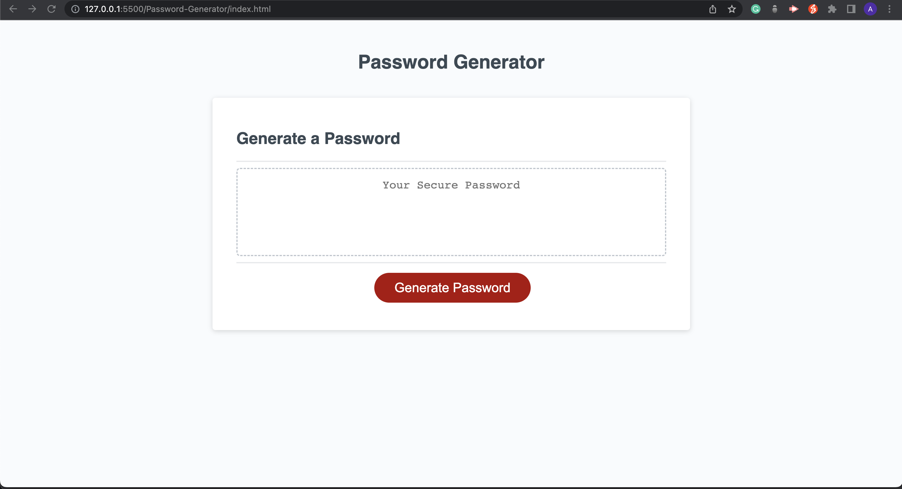
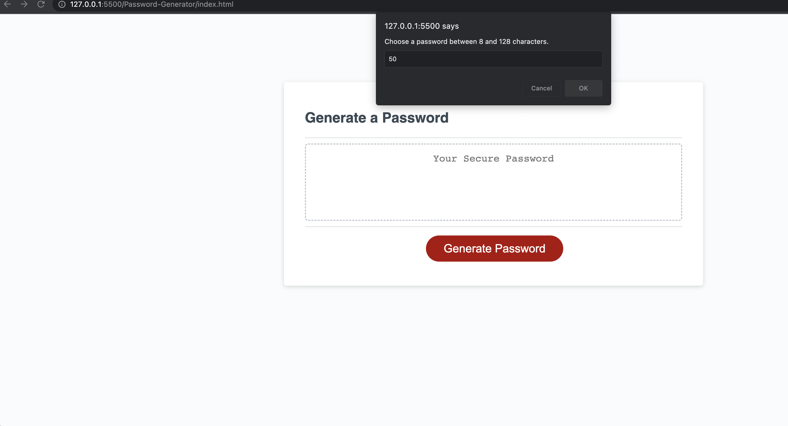
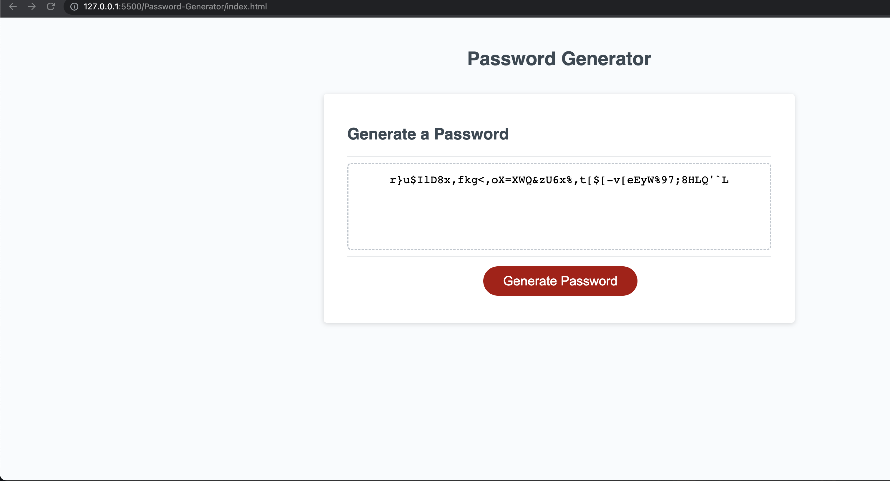

# Password-Generator

Design a password generator that will provide a password which is limited to be between 8 and 128 characters in length. The user is prompted if they would like to include upper case letters, lower case letters, numbers and/or special characters. Once the user answers each prompt they will be given a unique password on the screen that is tailored to their responses.

## Acceptance Criteria

* GIVEN I need a new, secure password
* WHEN I click the button to generate a password
* THEN I am presented with a series of prompts for password criteria
* WHEN prompted for password criteria
* THEN I select which criteria to include in the password
* WHEN prompted for the length of the password
* THEN I choose a length of at least 8 characters and no more than 128 characters
* WHEN asked for character types to include in the password
* THEN I confirm whether or not to include lowercase, uppercase, numeric, and/or special characters
* WHEN I answer each prompt
* THEN my input should be validated and at least one character type should be selected
* WHEN all prompts are answered
* THEN a password is generated that matches the selected criteria
* WHEN the password is generated
* THEN the password is either displayed in an alert or written to the page

## Description
This site was designed to assist client to randomly generate a password that meets certain criteria. I have using the following JavaScript knowledge:

- JavaScript arrays
- JavaScript variable
- JavaScript functions
- JavaScript Scope
- JavaScript for loop
- JavaScript prompt
- JavaScript Math random

This is the first JavaScript mini project I build since I started coding. It is a big challenge to me from the beginning. However,I know all things are difficult before they are easy. 

The first problem I have is creating password for loop layout in CSS. When I clicked each prompt, the password is now shown at all. So I spend more than half day to watch zoom recording. And I also search related pages on W3School . which I have learned how to make a random password. 

The second problem I have is my application only respond correctly when I generate a password the first time. The second time if I choose different character type, the result is still same character type as first time. I tried to use "console.log" message to debug the code. I find the problem is one JavaScript Variables which should inside the function. It solves the problem immediately. Because this variable is outside the function which makes every time when I run the function, it will add the previous result automatically.

All in all, from this project I learned most about how to debug the code. I use console.log message to test the code and find out the problem.

## Installation

N/A

## Usage

To view this application,the following image shows the landing page of the application, or click on https://mid30s.github.io/Password-Generator/

## Credits

Thanks for the start code provided by the web bootcamp.

## License

Please refer to the LICENSE in the repo.